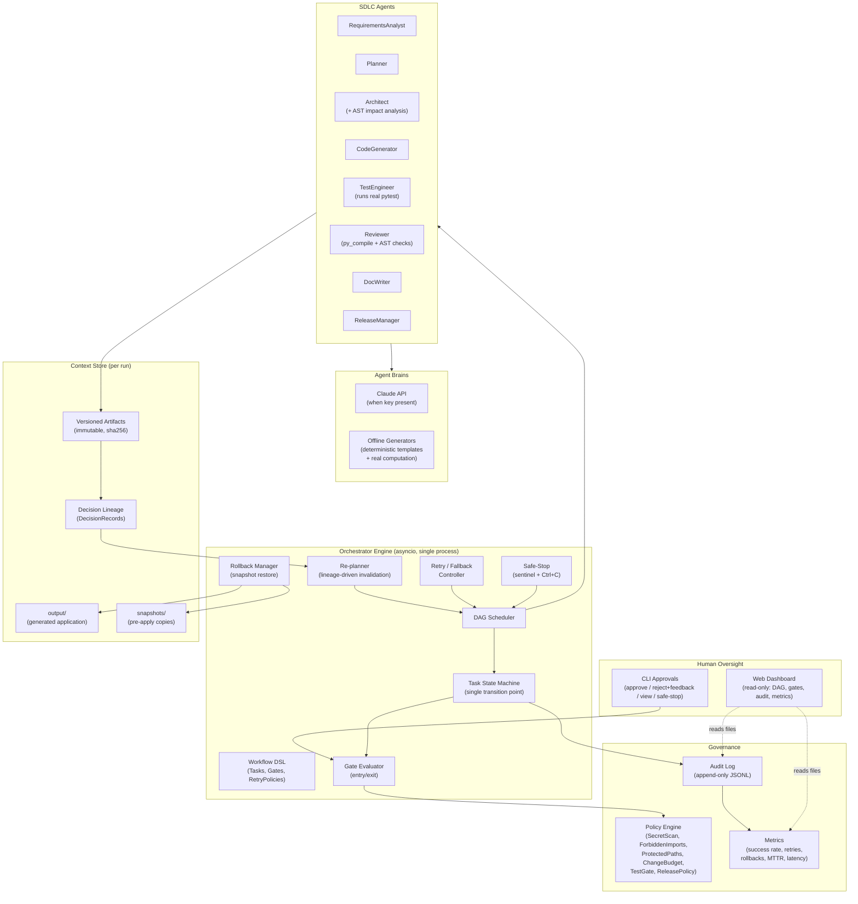
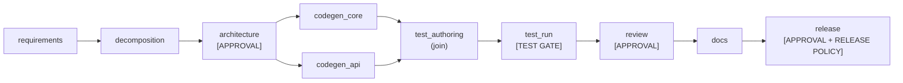
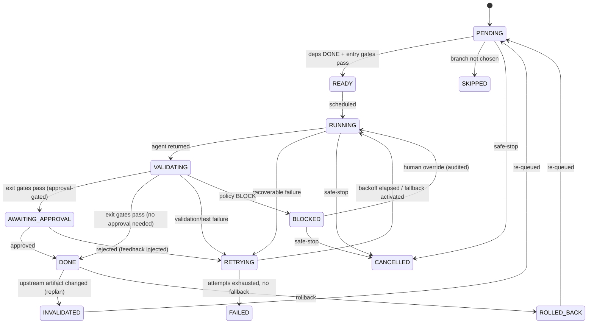
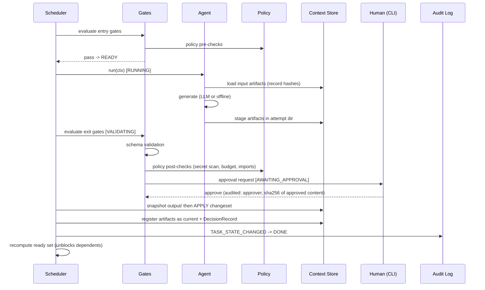

# Architecture Overview — Agentic SDLC Orchestration System

This document describes the architecture of the Agentic Software Engineering System: its components, the orchestration model, control flow, and the key design decisions behind them.

**Guiding principle (from the assignment):** agents execute under defined autonomy boundaries; humans own oversight, approvals, and final quality.

---

## 1. System Overview

The system has two distinct layers:

1. **The Agentic SDLC Orchestration System** (`agentic_sdlc/`) — the product being evaluated. A stateful, governed workflow engine that coordinates eight specialized SDLC agents (requirements, planning, architecture, code, test, review, docs, release) across an explicit dependency graph with entry/exit gates, human approval checkpoints, policy guardrails, retries/fallback/rollback, dynamic re-planning, and audit-grade observability.
2. **The Target Application** — a URL shortener service (FastAPI + SQLite) that the orchestration system builds (greenfield), enhances (brownfield), and hardens (ambiguous scenario). The generated application is real, runnable code whose test suite is genuinely executed as part of orchestration.



---

## 2. Components

### 2.1 Orchestrator Engine (`agentic_sdlc/orchestrator/`)

| Component | Responsibility |
|---|---|
| `workflow.py` | Declarative Python DSL: `Task(id, agent, depends_on, consumes, produces, entry_gates, exit_gates, retry, fallback, parallel_group)`. Validates the graph at load time: acyclicity (topological sort), every consumed artifact is produced upstream, every agent is registered. |
| `states.py` | Task state enum + an explicit `LEGAL_TRANSITIONS` table. A single `transition(task, new_state, reason)` function is the only place state changes — it rejects illegal transitions and emits exactly one audit event per transition. |
| `engine.py` | asyncio DAG scheduler. After every transition it recomputes the ready set and dispatches READY tasks inside a `TaskGroup`, bounded by a parallelism semaphore (default 3). Synchronization is implicit: a join node simply depends on all of its branches. |
| `context.py` / `artifacts.py` | The shared context store: immutable, versioned, sha256-hashed artifacts plus DecisionRecords forming the lineage graph. |
| `gates.py` | Entry/exit gate predicates: `ArtifactsExist`, `SchemaValid`, `PolicyGate`, `TestGate`, `ApprovalGate`, `NoSafeStop`. |
| `approvals.py` | CLI approval UX and the `--auto-approve` mode for CI. |
| `retry.py` | Bounded retries with exponential backoff + jitter, driven by failure classification (see 4.3). |
| `replanner.py` | Lineage-driven invalidation: when an upstream artifact changes, downstream completed work is invalidated and re-queued (see 4.5). |
| `rollback.py` | Restores the application directory from the pre-apply snapshot and retracts artifact versions (see 4.4). |
| `safestop.py` | Kill switch: `STOP` sentinel file (checked every scheduler cycle) + KeyboardInterrupt handling. |
| `audit.py` | Append-only JSONL event log; the single source of truth for observability. |
| `metrics.py` | Derives all reliability metrics from the audit log in a single pass. |

### 2.2 SDLC Agents (`agentic_sdlc/agents/`)

Eight role agents share one contract (`AgentBase`): load inputs (hashes recorded) -> policy pre-check -> generate (LLM or offline) -> materialize + schema-validate artifacts -> policy post-check -> record a DecisionRecord.

| Agent | Produces | Notable real behavior |
|---|---|---|
| RequirementsAnalyst | RequirementsSpec, AmbiguityReport | Surfaces ambiguity as clarifying questions + ranked interpretations |
| Planner | TaskPlan | Task decomposition with dependencies/sequencing |
| Architect | ArchitectureDoc, ApiContract, ImpactReport | **Brownfield: real AST scan** of the existing codebase — routes, functions, imports, data flows |
| CodeGenerator | CodeChangeSet | Staged file changesets (never writes directly to the app) |
| TestEngineer | TestSuite, TestReport | **Actually runs pytest** in an async subprocess against the generated app |
| Reviewer | ReviewReport | **Real static checks**: `py_compile` every file, AST import allowlist |
| DocWriter | README/API docs | Populated with real values (endpoints from ApiContract, counts from TestReport) |
| ReleaseManager | ReleaseChecklist | Computed from actual audit state: gates green, tests passed, approvals present |

### 2.3 Agent Brains (`agentic_sdlc/llm/`)

- **LLM mode** (`client.py`): Anthropic SDK; JSON-constrained prompts validated against the artifact's pydantic schema, with one repair round-trip on validation failure. SDK exceptions are classified TRANSIENT/FATAL for the retry engine.
- **Offline mode** (`offline.py`): deterministic generators reading parametrized templates, keyed by scenario. Offline is the *default demo path* — the system never depends on network availability. When LLM attempts are exhausted mid-run, the engine falls back to offline automatically (`FALLBACK_ACTIVATED` audit event).

### 2.4 Policy Engine (`agentic_sdlc/policy/`)

Six rules, each returning `PASS | WARN | BLOCK` with details, every evaluation logged as a `POLICY_CHECK` audit event carrying compliance tags (`sec-scan`, `change-control`, ...):

1. **SecretScan** — regex battery over generated file contents (cloud keys, PEM headers, hardcoded credentials) -> BLOCK.
2. **ForbiddenImports** — AST walk; allowlist of stdlib + approved packages; `eval`/`exec`/`os.system` in generated app code -> BLOCK.
3. **ProtectedPaths** — changesets may only write inside the run's `output/`; designated protected files require an explicit, audited human override.
4. **ChangeBudget** — max 15 files / 1200 LOC per changeset (change-control discipline).
5. **TestGateRule** — pytest exit code 0 and a minimum collected-test count.
6. **ReleasePolicy** — release gate requires zero unresolved BLOCKs, green tests on the latest code version, and all mandatory approvals present in the audit log.

### 2.5 Human Interfaces

- **CLI** — where authority lives: approvals, rejections with feedback, interpretation selection (ambiguous scenario), safe-stop. The approver sees artifact summaries, code diff stats, the policy results table, and lineage notes ("consumes requirements_spec v2").
- **Dashboard** (`agentic_sdlc/dashboard/`) — a separate read-only FastAPI process serving one static HTML page that polls run files: live DAG with state chips, gate/approval panel, audit tail, metrics cards. It shares no state with the engine — it reads `state.json` / `metrics.json` (written atomically) and tails `audit.jsonl`, so it works both live and post-run.

### 2.6 Target Application (`target_app/` and generated output)

URL shortener: FastAPI + stdlib sqlite3. Create (custom alias, TTL), redirect (with click recording), delete, stats, list, health. Base62 codes derived from `rowid + 100_000` (collision-free by construction), lazy TTL expiry with an injectable clock, fixed-window in-memory rate limiting. `target_app/` is the hand-built, tested baseline that the brownfield scenario enhances; the greenfield scenario generates the full application into the run's `output/` directory.

---

## 3. Orchestration Model

### 3.1 Explicit dependency graph with gates

Workflows are declared as data (frozen dataclasses), then validated and executed. The shared SDLC core:



Scenario definitions extend this core: brownfield inserts an `impact_analysis` stage after decomposition; the ambiguous scenario adds an interpretation-selection approval gate after requirements and three alternative branches, only one of which is activated.

**Entry gates** (evaluated when all dependencies are DONE): required artifacts exist *and are current* (their hashes match lineage expectations), policy pre-checks pass, safe-stop is not engaged. All pass -> READY. A policy failure -> BLOCKED with an audited reason.

**Exit gates** (evaluated after the agent returns, strictly ordered): schema/structural validation -> policy post-checks -> test gate (where applicable) -> approval gate last. Only after all exit gates pass is the task's changeset **applied** to `output/` and its artifacts registered as current.

> The stage-validate-apply discipline is the load-bearing decision: work is staged in an attempt directory, validated and approved there, and only then applied — after snapshotting the application directory. This is what makes rollback a simple restore instead of an inverse-diff problem.

### 3.2 Task state machine



All transitions flow through one function guarded by an explicit legal-transition table; every transition emits one audit event. There is no other mutation path — this centralization is what makes the audit trail trustworthy.

### 3.3 Concurrency model

Single-process **asyncio**. Rationale:

- Agent work is I/O-bound (HTTP to the LLM, subprocess pytest runs, file I/O) — no need for processes.
- Single-threaded state mutation means the state machine and context store need **no locks**.
- Windows' default Proactor event loop supports `asyncio.create_subprocess_exec`, required for real pytest execution.

Parallel branches (e.g., `codegen_core` and `codegen_api`) run concurrently under a semaphore (default 3); joins are DAG nodes depending on all branches. Blocking calls (`input()` for approvals, directory snapshots) are pushed to `asyncio.to_thread`. Windows constraint honored: no `loop.add_signal_handler` — safe-stop uses KeyboardInterrupt plus a sentinel file instead.

### 3.4 Context store and decision lineage

- **Artifacts** are immutable and versioned: `artifacts/<name>/v<N>/` with a sha256 hash, producer (`task_id`, attempt, mode: llm|offline), and timestamp, indexed by an atomically rewritten `manifest.json`. "Current" = highest non-retracted version.
- **Structured artifacts** (RequirementsSpec, TaskPlan, ArchitectureDoc, ImpactReport, CodeChangeSet, TestReport, ReviewReport, AmbiguityReport, ReleaseChecklist) have pydantic schemas that serve double duty as LLM output validators. Prose artifacts (docs) are Markdown.
- **DecisionRecords** — one per completed attempt: which artifact *versions* (with hashes) were consumed, which were produced, the rationale, the mode, and policy results. Together they form the lineage graph that powers re-planning, rollback scoping, and the final engineering summary.

---

## 4. Control Flow

### 4.1 Task lifecycle (happy path)



### 4.2 Approval checkpoints

Approval-gated by default: **requirements sign-off** (mandatory in the ambiguous scenario — this is where the human selects the interpretation), **design approval**, **code review / pre-merge**, **release readiness**. The approver sees: task and attempt, one-screen artifact summaries, diff stats for code (files / LOC added / removed), the policy check table, and lineage notes. Choices: approve, reject with feedback (the feedback becomes a new artifact version -> triggers re-planning), view full artifact, or safe-stop. `--auto-approve` exists for CI and smoke tests and records the approver as `"auto"`. Every approval event records who, what (sha256 of the approved content), and when — a non-repudiation property.

### 4.3 Failure handling: classify, retry, fall back

Failures are classified, and the class determines the response:

| Class | Examples | Response |
|---|---|---|
| TRANSIENT | LLM timeout/429, subprocess timeout | Bounded retries, exponential backoff + jitter |
| VALIDATION | Schema mismatch, test failure | Immediate retry with the failure output injected as a feedback input to the next attempt |
| POLICY_BLOCK | Secret detected, budget exceeded | No retry — BLOCKED awaiting human decision |
| FATAL | Unrecoverable errors | FAILED (run summary records it) |

When LLM attempts are exhausted, one final attempt runs the offline generator (`FALLBACK_ACTIVATED`). The demo therefore cannot be taken hostage by an API outage.

### 4.4 Rollback

Because changesets apply only after gates pass — and always after snapshotting — rollback is:

1. Restore `output/` from the pre-apply snapshot.
2. Retract the artifact version (manifest pointer returns to v(N-1)).
3. Transition the task to ROLLED_BACK; invalidate downstream consumers of the retracted version via lineage.
4. Emit a `ROLLBACK` audit event recording both content hashes.

### 4.5 Dynamic re-planning

Triggers: an approval rejection with feedback, a mid-run requirement revision (brownfield demo), or an interpretation selection (ambiguous demo).

Mechanism: any artifact gaining a new current version changes its hash. The re-planner walks DecisionRecords to find completed tasks whose *recorded input hash* no longer matches the current version — those flip `DONE -> INVALIDATED -> PENDING`, transitively through their outputs. The scheduler then re-executes exactly the affected subgraph. A `REPLAN_TRIGGERED` event records the cause and the affected task set. Branch selection uses the same machinery, plus `SKIPPED` for branches not chosen.

### 4.6 Safe-stop

Two paths: Ctrl+C at the console, or a `STOP` sentinel file written by `run_scenario.py stop <run_id>` from another terminal (also visible in the dashboard). On stop: no new dispatch, in-flight tasks cancelled at await points, all non-terminal tasks -> CANCELLED, a `SAFE_STOP` audit event, and a final state flush. Nothing half-applied: because apply is atomic-after-gates, a stopped run never leaves the application directory in a torn state.

---

## 5. Observability

### 5.1 Audit log (source of truth)

`audit.jsonl` — append-only, one JSON object per line, flushed per event:

```
{seq, ts (UTC ISO-8601), run_id, correlation_id (task_id:attempt), event_type, payload}
```

Event types: `RUN_STARTED/COMPLETED/FAILED`, `TASK_STATE_CHANGED`, `GATE_EVALUATED`, `POLICY_CHECK`, `APPROVAL_REQUESTED/GRANTED/REJECTED`, `ARTIFACT_CREATED`, `DECISION_RECORDED`, `RETRY_SCHEDULED`, `FALLBACK_ACTIVATED`, `ROLLBACK`, `REPLAN_TRIGGERED`, `SAFE_STOP`. Injected demo faults are explicitly marked (`payload.injected: true`) — deterministic choreography, honestly labeled.

### 5.2 Reliability metrics

Computed by a single fold over the audit log (no second bookkeeping system to drift out of sync): task success rate, retry count/rate, fallback count, rollback count, policy blocks, approval latency, **MTTR** (first failure event -> subsequent DONE per recovered task), per-stage latency (READY -> DONE), and end-to-end wall time. Written to `metrics.json`, rendered in the dashboard, and printed in the final CLI summary.

---

## 6. Controlled Autonomy Boundaries

| Agents decide autonomously | Humans decide |
|---|---|
| How to satisfy a stage's contract (content of specs, designs, code, tests, docs) | Whether a design is acceptable (design approval) |
| Retry timing and feedback incorporation | Whether code ships (review + release approvals) |
| Fallback from LLM to offline generation | Which interpretation of an ambiguous requirement to pursue |
| Test execution and verdict reporting | Overriding a policy BLOCK (audited override) |
| Re-planning scope after an upstream change | Stopping the system (safe-stop) |

Policy guardrails bound the agents' autonomy mechanically (not by convention): agents cannot write outside the run's output directory, cannot exceed the change budget, cannot ship secrets or forbidden constructs, and cannot pass the release gate without green tests and recorded approvals.

---

## 7. Key Design Decisions

| # | Decision | Alternatives considered | Rationale |
|---|---|---|---|
| 1 | **Python DSL for workflow declaration** | YAML/JSON workflow files | Gates are predicates and fault injections are callables; YAML would need a mini-interpreter. Dataclasses are type-checked at load and scenario files double as readable docs. |
| 2 | **Single-process asyncio** | Threads, multiprocessing, Celery-style queue | Work is I/O-bound; single-threaded mutation eliminates locks; Proactor loop supports async subprocess on Windows; right-sized for a prototype (documented scale-out path). |
| 3 | **Stage-validate-apply with snapshots** | In-place edits + git revert | Makes rollback a trivial restore, keeps the app directory always-consistent, and lets exit gates judge work before it lands. No git dependency in the engine. |
| 4 | **Hash-based lineage for re-planning** | Timestamp comparison; manual dependency lists | Content hashes detect *actual* change (a rewrite producing identical content triggers nothing); DecisionRecords give exact, minimal invalidation sets and an explainable "why did this re-run" story. |
| 5 | **Single transition point + legal-transition table** | State updates scattered through the engine | One choke point makes the audit log complete by construction — the credibility backbone of governance claims. |
| 6 | **Audit log as the only metrics source** | Separate metrics counters | One source of truth; metrics can be recomputed offline from the log; no drift between "what happened" and "what was measured". |
| 7 | **Hybrid LLM + deterministic offline agents** | LLM-only; simulation-only | Real agentic behavior when a key is present, but the demo never depends on network/API availability. Offline mode still does real work (AST analysis, pytest, py_compile). |
| 8 | **Approvals in CLI, dashboard read-only** | Web-based approvals | Authority stays in one reliable, scriptable channel; a read-only dashboard cannot destabilize the engine and works post-run for inspection. |
| 9 | **File-based dashboard decoupling** | WebSockets / shared memory | Atomic snapshot writes + JSONL tailing; zero coupling between processes; dashboard survives engine crashes and replays finished runs. |
| 10 | **stdlib sqlite3, no ORM** | SQLAlchemy | Fewer dependencies, zero Python 3.14 compatibility risk, schema is three tables — an ORM adds surface without value here. |
| 11 | **Base62 of monotonic rowid (+offset)** | Random codes with collision retry; hashing | Collision-free by construction, one code path, guaranteed >= 4 chars; trade-off (enumerable codes) documented. |
| 12 | **Scripted fault injection, honestly labeled** | Hoping failures occur naturally | Deterministic demos of retry/rollback/replan/policy-block; every injected event carries `injected: true` in the audit log. |

---

## 8. Deployment / Runtime View

```
Terminal 1: python run_scenario.py brownfield          # engine + CLI approvals
Terminal 2: python -m agentic_sdlc.dashboard           # http://localhost:8600 (read-only)
Terminal 3: python run_scenario.py stop <run_id>       # optional: safe-stop demo

workspace/runs/<run_id>/
├── audit.jsonl        # append-only event log (source of truth)
├── state.json         # atomic snapshot for the dashboard
├── metrics.json       # derived reliability metrics
├── artifacts/         # immutable versioned artifacts + manifest
├── output/            # the generated/modified application (runnable)
├── snapshots/         # pre-apply copies (rollback)
└── summary/FINAL_SUMMARY.md
```

---

## 9. Known Trade-offs (summary)

Documented in depth in `ENGINEERING_SUMMARY.md`: single-process engine (no distributed execution), no run-resume after safe-stop, in-memory rate limiter (single node), directory snapshots instead of git-based changesets, no coverage-percentage gate, offline creative artifacts are template-derived (labeled as such). Each is a deliberate scope decision for a 2-3 day prototype, with the production-hardening path described.
