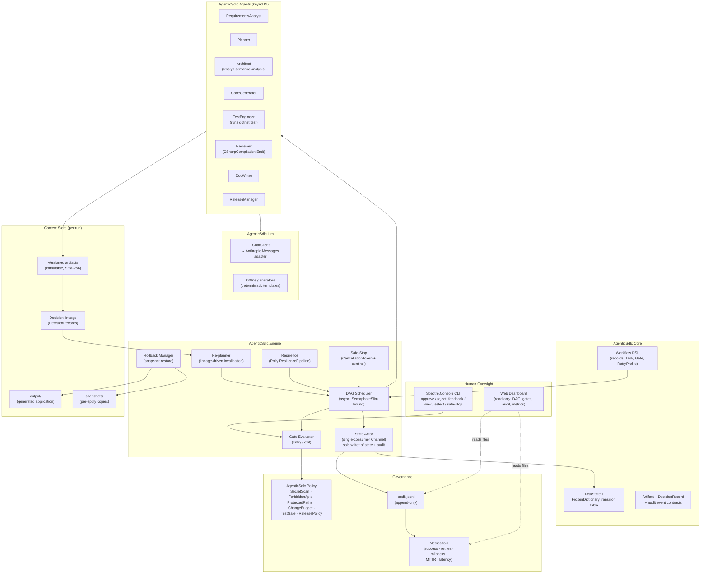
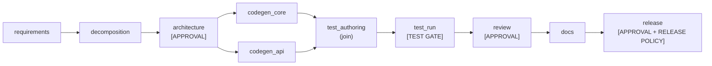
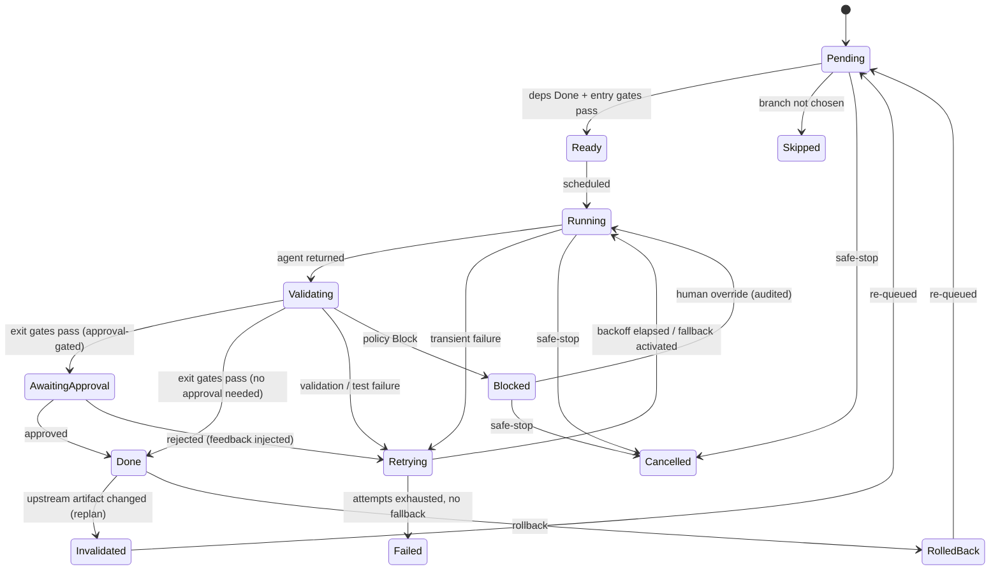
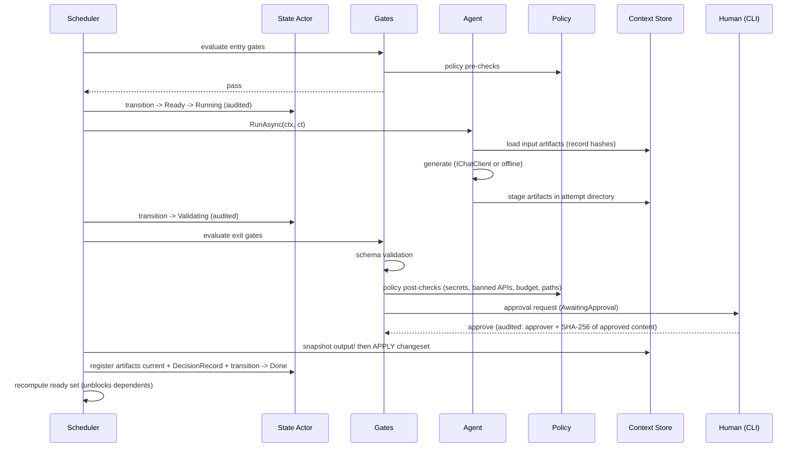

# Architecture Overview — Agentic SDLC Orchestration System

**Stack: C# 14 / .NET 10** | Companion docs: `../PLAN.md`, `SPECIFICATIONS.md`

This document describes the architecture of the Agentic Software Engineering System: its components, the orchestration model, control flow, and the key design decisions behind them.

**Guiding principle (from the assignment):** agents execute under defined autonomy boundaries; humans own oversight, approvals, and final quality.

---

## 1. System Overview

The system has two distinct layers:

1. **The Agentic SDLC Orchestration System** (`src/AgenticSdlc.*`) — the product being evaluated. A stateful, governed workflow engine that coordinates eight specialized SDLC agents across an explicit dependency graph with entry/exit gates, human approval checkpoints, policy guardrails, retries/fallback/rollback, dynamic re-planning, and audit-grade observability.
2. **The Target Application** (`src/TargetApp.UrlShortener` and generated output) — a URL shortener service (ASP.NET Core + SQLite) that the orchestration system builds (greenfield), enhances (brownfield), and hardens (ambiguous scenario). The generated application is real, compiling C# whose test suite is genuinely executed as part of orchestration.



---

## 2. Components

### 2.1 Core domain (`AgenticSdlc.Core`)

| Type | Responsibility |
|---|---|
| `WorkflowTask`, `Gate`, `RetryProfile` | The declarative DSL. C# records with `required` members; gates are predicates over `TaskContext`. Scenario files are written in this DSL and double as readable documentation. |
| `TaskState` + `LegalTransitions` | An enum plus a `FrozenDictionary<TaskState, FrozenSet<TaskState>>`. The transition table is data, not scattered `if` statements. |
| `Artifact`, `DecisionRecord`, `AuditEvent` | Serialization contracts, with source-generated `System.Text.Json` contexts for speed and trim-safety. |

### 2.2 Orchestrator engine (`AgenticSdlc.Engine`)

| Component | Responsibility |
|---|---|
| `StateActor` | A single-consumer `Channel<StateCommand>` loop. The **only** writer of task states, the artifact manifest, and the audit log. Validates each transition against the legal-transition table, rejects illegal ones, and emits exactly one audit event per accepted transition. |
| `Scheduler` | Recomputes the ready set after every transition and dispatches Ready tasks onto the thread pool, bounded by `SemaphoreSlim` (default 3). Joins are `Task.WhenAll`. Synchronization is implicit in the DAG: a join node simply depends on all branches. |
| `GateEvaluator` | Evaluates entry and exit gates in defined order, short-circuiting on the first blocking verdict. |
| `ResilienceRunner` | Polly v8 `ResiliencePipeline` per retry profile: exponential backoff with jitter, timeout, bounded attempts. Failure classification decides which pipeline (if any) applies. |
| `Replanner` | Lineage-driven invalidation when an upstream artifact changes (§4.5). |
| `RollbackManager` | Restores `output/` from the pre-apply snapshot and retracts artifact versions (§4.4). |
| `SafeStop` | `CancellationTokenSource` for in-process cancellation plus a cross-process `STOP` sentinel file polled each scheduler cycle. |
| `AuditWriter` | Append-only JSONL, flushed per event. Invoked only from the state actor, which is what makes the log complete and correctly ordered. |
| `MetricsFolder` | Derives every reliability metric from the audit log in one pass; also publishes `System.Diagnostics.Metrics` counters so the same signals are OpenTelemetry-scrapable in a real deployment. |

### 2.3 SDLC agents (`AgenticSdlc.Agents`)

Eight role agents share one contract (`AgentBase`): load inputs (hashes recorded) → policy pre-check → generate (LLM or offline) → materialize and validate artifacts → policy post-check → record a `DecisionRecord`. They are registered as **keyed DI services** and resolved by the scheduler from each task's agent key. Agents write only into their attempt directory; **only the engine applies changesets to `output/`**.

| Agent | Produces | Real computation (independent of LLM/offline mode) |
|---|---|---|
| RequirementsAnalyst | RequirementsSpec, AmbiguityReport | Surfaces ambiguity as clarifying questions plus ranked interpretations |
| Planner | TaskPlan | Decomposition with dependencies and sequencing |
| Architect | ArchitectureDoc, ApiContract, **ImpactReport** | **Roslyn semantic model**: loads the existing project, resolves symbols, finds references and call sites → impacted types, endpoints, data flows, regression risks |
| CodeGenerator | CodeChangeSet | Staged changesets, never direct writes |
| TestEngineer | TestSuite, TestReport | **Executes `dotnet test`** in an isolated subprocess; TestReport parsed from the TRX report, with exit code and stdout tail as fallback |
| Reviewer | ReviewReport | **In-memory `CSharpCompilation.Emit()`** producing real compiler diagnostics with source locations, plus a banned-API semantic walk |
| DocWriter | README / API docs | Populated from real values (endpoints from ApiContract, counts from TestReport) |
| ReleaseManager | ReleaseChecklist | Computed from actual audit state: gates green, tests passed on the latest applied version, approvals present |

### 2.4 Agent brains (`AgenticSdlc.Llm`)

- **LLM mode**: `Microsoft.Extensions.AI.IChatClient` provides a provider-agnostic abstraction with a middleware pipeline (logging, telemetry). Behind it is a thin `HttpClient` adapter for the Anthropic Messages API — deliberately no third-party SDK, since none is first-party and ~150 lines of adapter carry less supply-chain risk than a community package. Structured output uses `JsonSchemaExporter` to generate the JSON schema **from the same C# record** used for deserialization, so prompt contract and validation contract cannot drift. One repair round-trip is attempted on a validation failure before the attempt is classified as a failure.
- **Offline mode**: deterministic generators over parametrized templates, keyed by scenario. Offline is the *default demo path* — the system never depends on network availability. When LLM attempts are exhausted mid-run, the engine falls back to offline automatically and records `FALLBACK_ACTIVATED`.

### 2.5 Policy engine (`AgenticSdlc.Policy`)

Six rules, each returning `Pass | Warn | Block` with details; every evaluation is logged as a `POLICY_CHECK` audit event carrying compliance tags (`sec-scan`, `change-control`, `supply-chain`, `quality-gate`).

1. **SecretScan** — regex battery over generated content (cloud access keys, PEM private-key headers, hardcoded credential assignments) → Block.
2. **ForbiddenApis** — a Roslyn **semantic** walk against a banned-symbol list (`Process.Start`, `Reflection.Emit`, P/Invoke, dynamic code loading) plus a NuGet allowlist (the generated app may reference only `Microsoft.Data.Sqlite` beyond the shared framework) → Block. Same enforcement model as `Microsoft.CodeAnalysis.BannedApiAnalyzers`, but run in-process so verdicts land in the audit log instead of merely failing a build.
3. **ProtectedPaths** — changesets may write only inside the run's `output/`, verified after `Path.GetFullPath` normalization so `..` traversal is caught; designated protected files require an explicit human override, itself audited.
4. **ChangeBudget** — Block above 15 files or 1200 changed LOC per changeset.
5. **TestGate** — `dotnet test` exit code 0 and a minimum collected-test count.
6. **ReleasePolicy** — zero unresolved Blocks, TestGate green on the latest applied code, all mandatory approvals present.

### 2.6 Human interfaces

- **CLI** (`AgenticSdlc.Cli`, Spectre.Console) — where authority lives: approvals, rejections with feedback, interpretation selection via `SelectionPrompt`, safe-stop. The approver sees artifact summaries, changeset diff statistics, a policy results `Table`, and lineage notes ("consumes requirements_spec v2"). Spectre also handles Windows console encoding and colour correctly, so no ASCII-only restriction is needed.
- **Dashboard** (`AgenticSdlc.Dashboard`) — a separate read-only minimal-API process serving one static page that polls run files: live DAG with state chips, gates/approvals panel, audit tail, metrics cards. It shares no state with the engine — it reads `state.json` / `metrics.json` (written via atomic replace) and tails `audit.jsonl` by `seq`, so it works live, survives an engine crash, and replays finished runs.

### 2.7 Target application

ASP.NET Core minimal APIs with `Microsoft.Data.Sqlite`: create (custom alias, TTL), redirect (with click recording), delete, stats, list, health. Base62 codes derived from `rowid + 100000` (collision-free by construction), lazy TTL expiry against an injected `TimeProvider`, and fixed-window rate limiting from the built-in `RateLimiter` middleware. `TargetApp.UrlShortener` is the hand-built, tested baseline that the brownfield scenario enhances; the greenfield scenario generates the full application into the run's `output/`.

---

## 3. Orchestration Model

### 3.1 Explicit dependency graph with gates

Workflows are declared as data (records), then validated and executed. Validation at load: acyclicity via topological sort, every consumed artifact produced upstream, every agent key registered in DI. Failure aborts before any task runs.



Scenario definitions extend this core: brownfield inserts an `impact_analysis` stage after decomposition; the ambiguous scenario adds an interpretation-selection approval gate after requirements plus three alternative branches, only one of which is activated.

**Entry gates** (evaluated when all dependencies are Done): required artifacts exist *and are current* (content hash matches lineage expectation), policy pre-checks pass, safe-stop not engaged. All pass → Ready. A policy failure → Blocked with an audited reason.

**Exit gates** (evaluated after the agent returns, strictly ordered): schema/structural validation → policy post-checks → test gate (where applicable) → approval gate last. Only after all exit gates pass is the changeset **applied** to `output/` and its artifacts registered as current.

> The stage → validate → apply discipline is the load-bearing decision: work is staged in an attempt directory, validated and approved there, and only then applied — after snapshotting the application directory. This is what makes rollback a simple restore instead of an inverse-diff problem.

### 3.2 Task state machine



All transitions flow through the state actor, guarded by an explicit legal-transition table; every accepted transition emits exactly one audit event. There is no other mutation path — this centralization is what makes the audit trail trustworthy.

### 3.3 Concurrency model

Single process, `async`/`await` over the .NET thread pool.

The important detail: **.NET gives no single-threaded execution guarantee**. Unlike an event-loop runtime where callbacks are inherently serialized, `Task` continuations run on pool threads, so shared mutable state would need locking. Rather than sprinkle locks — which invites deadlock and makes "one transition, one audit event" a matter of discipline rather than structure — state mutation is funnelled through an **actor**:

- Every state change is a `StateCommand` written to a `Channel<StateCommand>`.
- A single consumer loop drains the channel and is the sole writer of task states, the artifact manifest, and the audit log.
- Serialization is therefore structural, not conventional: no locks exist anywhere in the engine, and audit ordering matches causal ordering by construction.

Agent work runs concurrently on the pool, bounded by `SemaphoreSlim` (default 3, configurable). Parallel branches such as `codegen_core` and `codegen_api` execute simultaneously; joins are `Task.WhenAll` on nodes that depend on all branches. Blocking work — approval prompts and directory snapshots — is kept off the scheduler path.

Safe-stop uses both mechanisms it needs: a `CancellationToken` threaded through every await for in-process cancellation, and a `STOP` sentinel file for the cross-process case (`stop <runId>` from a second terminal), polled each scheduler cycle.

### 3.4 Context store and decision lineage

- **Artifacts** are immutable and versioned under `artifacts/<name>/v<N>/`, each with a SHA-256 hash, producer (task id, attempt, mode), and timestamp, indexed by a `manifest.json` rewritten atomically (temp file + `File.Move(overwrite: true)`). "Current" means the highest non-retracted version.
- **Structured artifacts** (RequirementsSpec, TaskPlan, ArchitectureDoc, ApiContract, ImpactReport, CodeChangeSet, TestReport, ReviewReport, AmbiguityReport, ReleaseChecklist) are C# records serialized with source-generated JSON contexts. The same records generate the JSON schema sent to the model, so validation and prompting share one definition.
- **DecisionRecords** — one per completed attempt: which artifact *versions* (with hashes) were consumed, which were produced, the rationale, the mode, and policy results. Together they form the lineage graph powering re-planning, rollback scoping, and the final engineering summary.

---

## 4. Control Flow

### 4.1 Task lifecycle (happy path)



### 4.2 Approval checkpoints

Approval-gated by default: **design approval**, **code review / pre-merge**, and **release readiness** in all scenarios, plus **requirements sign-off** in the ambiguous scenario, where the human selects the interpretation. The approver sees task and attempt, one-screen artifact summaries, changeset diff statistics (files, LOC added/removed), the policy check table, and lineage notes.

Choices: approve; reject with feedback (the feedback becomes a new artifact version, which triggers re-planning); view the full artifact; or safe-stop. `--auto-approve` exists for CI and smoke tests and records the approver as `auto`, selecting the analyst-recommended interpretation where a choice is required. Every approval event records who, what (SHA-256 of the approved content), and when — a non-repudiation property.

### 4.3 Failure handling: classify, retry, fall back

| Class | Examples | Response |
|---|---|---|
| `Transient` | HTTP 429/timeout from the model API, `dotnet test` subprocess timeout | Polly pipeline: bounded retries, exponential backoff with jitter |
| `Validation` | Schema mismatch, failing tests, compiler diagnostics | Immediate retry with the failure output injected as a feedback input to the next attempt |
| `PolicyBlock` | Secret detected, banned API, budget exceeded | No retry — Blocked, awaiting a human decision |
| `Fatal` | Unrecoverable errors | Failed; recorded in the run summary |

When LLM attempts are exhausted and an offline generator exists, the engine makes one final fallback attempt (`FALLBACK_ACTIVATED`). The demo therefore cannot be held hostage by an API outage.

### 4.4 Rollback

Because changesets apply only after gates pass — and always after snapshotting — rollback is:

1. Restore `output/` from the pre-apply snapshot.
2. Retract the artifact version (the manifest pointer returns to v(N−1)).
3. Transition the task to RolledBack and invalidate downstream consumers of the retracted version via lineage.
4. Emit a `ROLLBACK` audit event recording both content hashes.

### 4.5 Dynamic re-planning

Triggers: an approval rejection with feedback, a mid-run requirement revision (brownfield demo), or an interpretation selection (ambiguous demo).

Mechanism: any artifact gaining a new current version changes its hash. The replanner walks DecisionRecords to find completed tasks whose *recorded input hash* no longer matches the current version — those flip `Done → Invalidated → Pending`, transitively through their outputs. The scheduler then re-executes exactly the affected subgraph. A `REPLAN_TRIGGERED` event records the cause and the affected task set. Branch selection uses the same machinery, plus `Skipped` for branches not chosen.

### 4.6 Safe-stop

Two paths: `Ctrl+C` at the console (cancels the root `CancellationTokenSource`), or a `STOP` sentinel file written by `stop <runId>` from another terminal and also surfaced on the dashboard. On stop: no new dispatch, in-flight tasks cancelled at await points, all non-terminal tasks → Cancelled, a `SAFE_STOP` audit event, and a final state flush. Nothing is half-applied: because apply is atomic-after-gates, a stopped run never leaves the application directory in a torn state.

---

## 5. Observability

### 5.1 Audit log (source of truth)

`audit.jsonl` — append-only, one JSON object per line, flushed per event, written only by the state actor:

```
{seq, ts (UTC ISO-8601), runId, correlationId (taskId:attempt), eventType, payload}
```

Event types: `RUN_STARTED/COMPLETED/FAILED`, `TASK_STATE_CHANGED`, `GATE_EVALUATED`, `POLICY_CHECK`, `APPROVAL_REQUESTED/GRANTED/REJECTED`, `ARTIFACT_CREATED`, `DECISION_RECORDED`, `RETRY_SCHEDULED`, `FALLBACK_ACTIVATED`, `ROLLBACK`, `REPLAN_TRIGGERED`, `SAFE_STOP`. Injected demo faults are explicitly marked (`payload.injected: true`) — deterministic choreography, honestly labelled.

### 5.2 Reliability metrics

Computed by a single fold over the audit log — there is no second bookkeeping system that could drift out of sync: task success rate, retry count and rate, fallback count, rollback count, policy blocks, approval latency, **MTTR** (first failure event → subsequent Done, per recovered task), per-stage latency (Ready → Done), and end-to-end wall time. Written to `metrics.json`, rendered on the dashboard, and printed in the final CLI summary table.

The same signals are published as `System.Diagnostics.Metrics` instruments, so in a production deployment they would be scraped by OpenTelemetry without changing the engine — the file-based path exists because it is self-contained and inspectable offline.

---

## 6. Controlled Autonomy Boundaries

| Agents decide autonomously | Humans decide |
|---|---|
| How to satisfy a stage's contract (content of specs, designs, code, tests, docs) | Whether a design is acceptable (design approval) |
| Retry timing and how to incorporate feedback | Whether code ships (review and release approvals) |
| Falling back from LLM to offline generation | Which interpretation of an ambiguous requirement to pursue |
| Test execution and verdict reporting | Overriding a policy Block (audited override) |
| Re-planning scope after an upstream change | Stopping the system (safe-stop) |

Policy guardrails bound agent autonomy **mechanically, not by convention**: agents cannot write outside the run's output directory, cannot exceed the change budget, cannot ship secrets or banned APIs, and cannot pass the release gate without green tests and recorded approvals. Agents cannot even apply their own changesets — only the engine does, after gates.

---

## 7. Key Design Decisions

| # | Decision | Alternatives considered | Rationale |
|---|---|---|---|
| 1 | **C# records as the workflow DSL** | YAML/JSON workflow files | Gates are predicates and fault injections carry behavior; a serialized format would need a mini-interpreter. `required` members give compile-time completeness; scenario files double as readable docs. |
| 2 | **Actor-style `Channel` serialization of all state mutation** | Locks around shared state; an immutable state snapshot with CAS | The thread pool offers no single-threaded guarantee. An actor makes serialization *structural*: no locks exist, and "one transition → one audit event" holds by construction rather than by reviewer vigilance. |
| 3 | **Stage → validate → apply with snapshots** | In-place edits with git revert | Makes rollback a trivial restore, keeps the app directory always consistent, and lets exit gates judge work before it lands. No git dependency in the engine. |
| 4 | **Hash-based lineage for re-planning** | Timestamp comparison; hand-maintained dependency lists | Content hashes detect *actual* change (a regeneration producing identical bytes triggers nothing). DecisionRecords give exact, minimal invalidation sets and an explainable "why did this re-run". |
| 5 | **Single transition point + legal-transition table** | State updates scattered through the engine | One choke point makes the audit log complete by construction — the credibility backbone of every governance claim. |
| 6 | **Audit log as the sole metrics source** | Separate metric counters as the source of truth | One source of truth; metrics are recomputable offline from the log; no drift between "what happened" and "what was measured". `Meter` instruments mirror it for export, but do not define it. |
| 7 | **Hybrid LLM + deterministic offline agents** | LLM-only; simulation-only | Real agentic behavior when a key is present, but the demo never depends on network availability. Offline mode still does real work — Roslyn analysis, compilation, `dotnet test`. |
| 8 | **Roslyn semantic analysis for codebase reasoning** | Regex/text search; syntax-tree-only walking | A semantic model resolves symbols and finds actual references and call sites, so the brownfield ImpactReport reflects the real call graph rather than string matches. This is the single largest capability gain from the platform. |
| 9 | **Reviewer compiles generated code in memory** | Shelling out to `dotnet build` for review | `CSharpCompilation.Emit()` returns structured diagnostics with source locations in-process, far faster than a build, and the results feed the audit log directly. |
| 10 | **Policy enforced in-process, modelled on `BannedApiAnalyzers`** | Build-time analyzers only | A build-time analyzer fails a build; an in-process check produces a *verdict with reasons* that becomes an audit event and can be overridden by a human with attribution. Governance needs the record, not just the failure. |
| 11 | **Built-in platform capabilities over hand-rolled code** | Custom rate limiter, custom health endpoint, custom clock abstraction | `RateLimiter` middleware, `HealthChecks`, and `TimeProvider` are first-class in .NET. Hand-rolling them would add bugs, add code to review, and signal unfamiliarity with the platform. `FakeTimeProvider` also removes any need for a time-mocking library. |
| 12 | **Polly for resilience** | Hand-rolled retry loops | Exponential backoff with jitter, timeout, and circuit breaking are solved problems; the standard library for it is well understood by reviewers and better tested than anything written in a two-day window. |
| 13 | **`JsonSchemaExporter` from the same records used for validation** | Hand-written JSON schemas alongside C# types | One definition drives both the model's output contract and deserialization validation, so the two cannot drift. |
| 14 | **`Microsoft.Data.Sqlite`, no ORM** | EF Core + SQLite | Three tables do not justify an ORM. Keeps the generated project to a single NuGet reference, which also keeps the ForbiddenApis allowlist tight and the build fast. |
| 15 | **Base62 of monotonic rowid (+ offset)** | Random codes with collision retry; hashing | Collision-free by construction, one code path, guaranteed ≥ 4 characters. Trade-off (codes are enumerable) is documented. |
| 16 | **Approvals in the CLI, dashboard read-only** | Web-based approvals; Blazor Server with SignalR | Authority stays in one reliable, scriptable channel. A read-only, file-polling dashboard cannot destabilize the engine, works after the run ends, and needs no npm or build step. |
| 17 | **Scripted fault injection, honestly labelled** | Hoping failures occur naturally | Deterministic demonstrations of retry, rollback, re-planning, and policy blocking. Every injected event carries `injected: true` in the audit log. In a compiled language each injected bug must compile and fail at test time — a build failure would demonstrate the wrong failure class. |

---

## 8. Deployment / Runtime View

```
Terminal 1: dotnet run --project src/AgenticSdlc.Cli -- run brownfield
Terminal 2: dotnet run --project src/AgenticSdlc.Dashboard        # http://localhost:8600 (read-only)
Terminal 3: dotnet run --project src/AgenticSdlc.Cli -- stop <runId>

workspace/runs/<runId>/
├── audit.jsonl        # append-only event log (source of truth)
├── state.json         # atomic snapshot for the dashboard
├── metrics.json       # derived reliability metrics
├── artifacts/         # immutable versioned artifacts + manifest
├── output/            # the generated/modified application (compiles and runs)
├── snapshots/         # pre-apply copies (rollback)
└── summary/FINAL_SUMMARY.md
```

---

## 9. Known Trade-offs (summary)

Documented in depth in `ENGINEERING_SUMMARY.md`:

- **Build-cycle latency** — `dotnet build` + `dotnet test` costs 5–15 s per attempt, so a scenario with retries runs 6–10 minutes rather than 2–4. Mitigated by a minimal generated project, a warm NuGet cache, and `--no-restore` after the first restore. This is the main price of a compiled stack, paid for compiler-verified output and semantic analysis.
- **First build requires network** for NuGet restore, so the "offline demo" claim holds for the *demo*, not the initial *setup*.
- Single-process engine (no distributed execution), no run resume after safe-stop, in-memory rate limiter (single node), directory snapshots rather than git-based changesets, no coverage-percentage gate, and offline creative artifacts are template-derived (labelled as such).

Each is a deliberate scope decision for a 2–3 day prototype, with the production-hardening path described.
